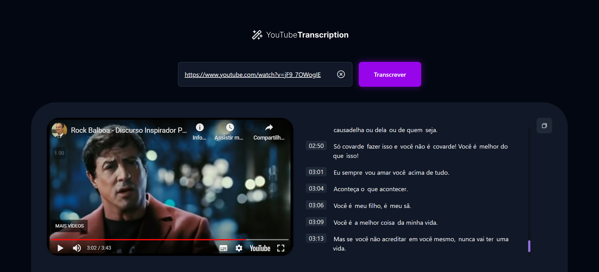

<h1 align="center"> Transcrição de vídeo com IA </h1>

Projeto de uma página de transcrição de vídeos do YouTube que utiliza IA para transcrever automaticamente

  <a href="#-tecnologias">Tecnologias</a>&nbsp;&nbsp;&nbsp;|&nbsp;&nbsp;
  <a href="#-layout">Layout</a>

  

## 🚀 Tecnologias

Esse projeto foi desenvolvido com as seguintes tecnologias:

- HTML e CSS
- JavaScript
- Node.js
- Express
- Axios
- Transformers.js
- WhisperAI
- Vite
- Figma

## 🔖 Layout

Você pode visualizar o layout do projeto através [DESSE LINK](https://www.figma.com/community/file/1268564660141195165)