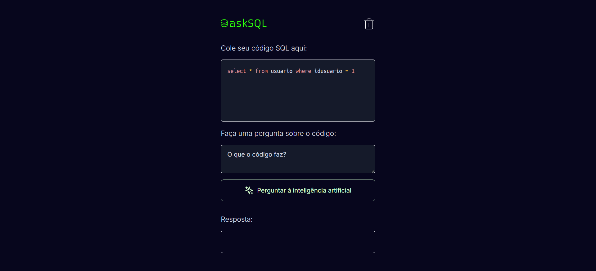

<h1 align="center"> App de tradução de SQL com IA </h1>

App de tradução de SQL, capaz de receber um schema e responder com queries a perguntas feitas em linguagem natural através de inteligência artificial

  <a href="#-como-executar-aplicação">Como Executar Aplicação</a>&nbsp;&nbsp;&nbsp;|&nbsp;&nbsp;
  <a href="#-tecnologias">Tecnologias</a>&nbsp;&nbsp;&nbsp;|&nbsp;&nbsp;
  <a href="#-layout">Layout</a>

  

## 💻 Como Executar Aplicação

1 - Instalação de Dependências:

- Execute o comando a seguir no terminal para instalar as dependências do projeto: `npm install`

2 - Criar uma Conta na OpenAI:

- Acesse [OpenAI](https://platform.openai.com) e crie uma conta, caso ainda não tenha uma.

3 - Gerar uma API Key:

- Após criar sua conta, vá para [API Keys](https://platform.openai.com/api-keys) e gere uma nova chave de API.

4 - Configurar o Arquivo `.env`:

- Crie um arquivo chamado .env na raiz do seu projeto (se ainda não existir).
- Adicione a seguinte linha, substituindo sua-chave-api pela chave que você gerou: `OPENAI_API_KEY=sua-chave-api`

5 - Executar Aplicação:

- Por fim, inicie o servidor de desenvolvimento com o seguinte comando: `npm run dev`

## 🚀 Tecnologias

Esse projeto foi desenvolvido com as seguintes tecnologias:

- HTML e CSS
- JavaScript
- React
- Next
- OpenAI Edge
- Figma

## 🔖 Layout

Você pode visualizar o layout do projeto através [DESSE LINK](https://www.figma.com/community/file/1271110680628406853)