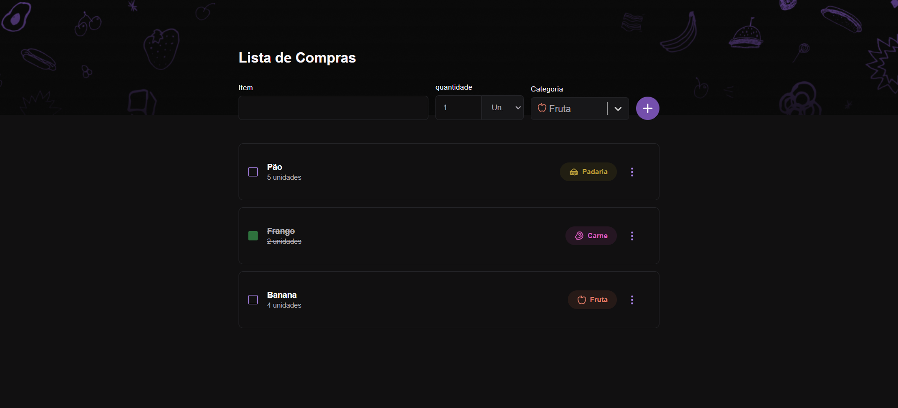

<h1 align="center"> Lista de Compras </h1>

O Lista de Compras é um checklist web e mobile, para que você possa fazer o registro de itens a comprar

  <a href="#-como-executar-aplicação">Como Executar Aplicação</a>&nbsp;&nbsp;&nbsp;|&nbsp;&nbsp;
  <a href="#-tecnologias">Tecnologias</a>&nbsp;&nbsp;&nbsp;|&nbsp;&nbsp;
  <a href="#-layout">Layout</a>

  

## 💻 Como Executar Aplicação

1 - Instalação de Dependências:

- Versão do Node.js: 20.16.0
- Execute o comando a seguir no terminal para instalar as dependências do projeto: `npm install`

2 - Executar Aplicação:

- Por fim, inicie o servidor de desenvolvimento com o seguinte comando: `npm run dev`

## 🚀 Tecnologias

Esse projeto foi desenvolvido com as seguintes tecnologias:

- Vite e Styled-Components
- Git e Github
- React-Select
- Figma

## 🔖 Layout

Você pode visualizar o layout do projeto através [DESSE LINK](https://www.figma.com/community/file/1276169043084346929)
