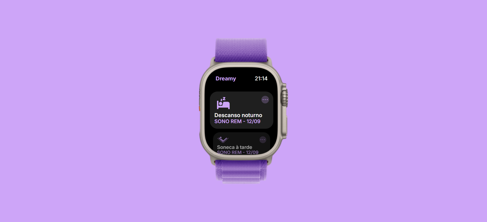

<h1 align="center"> App de Sono para Smartwatch </h1>

App de Sono para Smartwatch, que exibe um histórico de sono, incluindo tipo de sono e data

  <a href="#-tecnologias">Tecnologias</a>&nbsp;&nbsp;&nbsp;|&nbsp;&nbsp;
  <a href="#-layout">Layout</a>

  

## 🚀 Tecnologias

Esse projeto foi desenvolvido com as seguintes tecnologias:

- HTML
- CSS
- Javascript
- Figma
- SwiperJS

## 🔖 Layout

Você pode visualizar o layout do projeto através [DESSE LINK](https://www.figma.com/community/file/1283783865388732530)