<h1 align="center">
  
</h1>

<h3 align="center">
  #boraCodar
</h3>

<a href="https://www.rocketseat.com.br/boracodar">#boraCodar</a> são desafios semanais, promovido pela Rocketseat para ensino de tecnologias WEB

<table align="center">
  <thead>
    <tr>
      <th>
         
        
<small>#</small>

      </th>
      <th>
         
        
<small>NOME</small>

      </th>
      <th align="center">
        
        
<small>PREVIEW</small>

      </th>
    </tr>
  </thead>
  <tbody>
    <tr>
      <td align="center">
        01
      </td>
      <td align="center">
        <a href="01-player-musica">Player de música</a>
      </td>
      <td align="center">
        
      </td>
    </tr>
    <tr>
      <td align="center">
        02
      </td>
      <td align="center">
        <a href="02-card-produto">Card de produto</a>
      </td>
      <td align="center">
        
      </td>
    </tr>
    <tr>
      <td align="center">
        03
      </td>
      <td align="center">
        <a href="03-botoes-cursores">Botões e cursores</a>
      </td>
      <td align="center">
        <a href="03-botoes-cursores">
          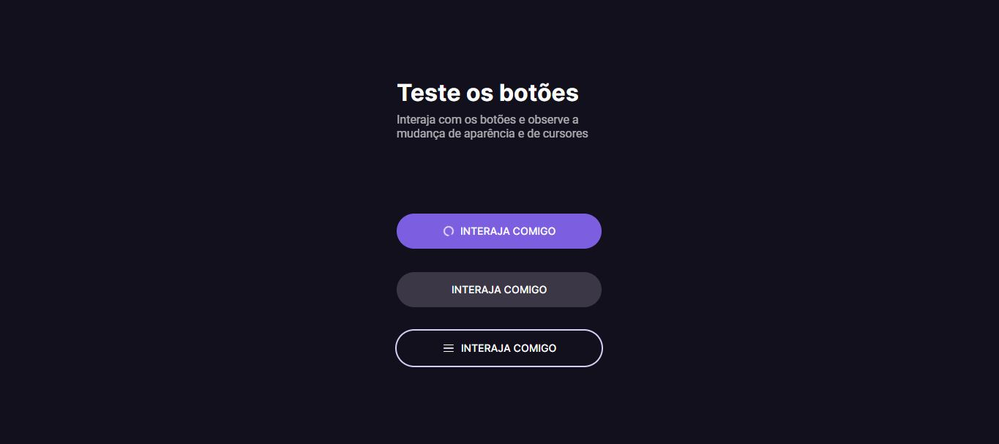
        </a>
      </td>
    </tr>
    <tr>
      <td align="center">
        04
      </td>
      <td align="center">
        <a href="04-chat">Chat</a>
      </td>
      <td align="center">
        
      </td>
    </tr>
    <tr>
      <td align="center">
        05
      </td>
      <td align="center">
        <a href="05-calculadora">Calculadora</a>
      </td>
      <td align="center">
        <a href="05-calculadora">
          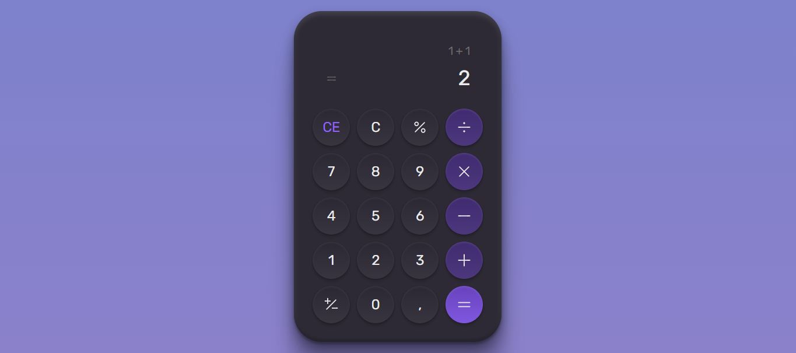
        </a>
      </td>
    </tr>
    <tr>
      <td align="center">
        06
      </td>
      <td align="center">
        <a href="06-cartao-embarque">Cartão de embarque</a>
      </td>
      <td align="center">
        <a href="06-cartao-embarque">
          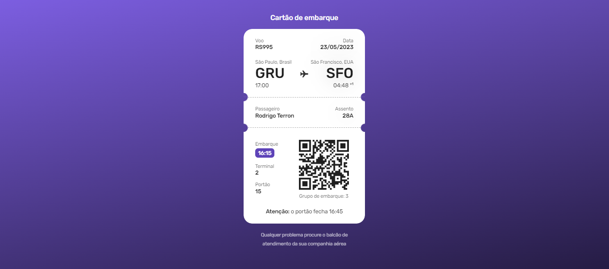
        </a>
      </td>
    </tr>
    <tr>
      <td align="center">
        07
      </td>
      <td align="center">
        <a href="07-site-bloco-carnaval">Site de bloco de carnaval</a>
      </td>
      <td align="center">
        <a href="07-site-bloco-carnaval">
          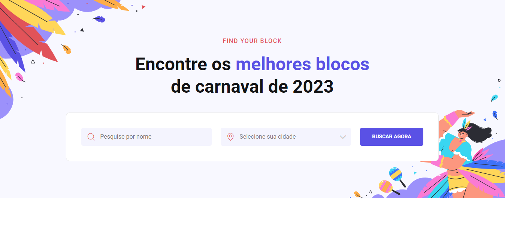
        </a>
      </td>
    </tr>
    <tr>
      <td align="center">
        08
      </td>
      <td align="center">
        <a href="08-dashboard">Dashboard</a>
      </td>
      <td align="center">
        <a href="08-dashboard">
          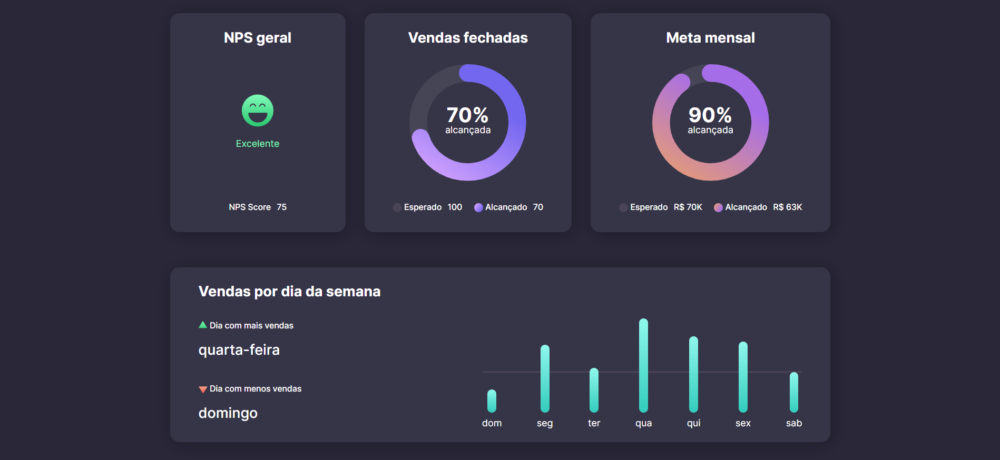
        </a>
      </td>
    </tr>
    <tr>
      <td align="center">
        09
      </td>
      <td align="center">
        <a href="09-conversor-moedas">Conversor de moedas</a>
      </td>
      <td align="center">
        <a href="09-conversor-moedas">
          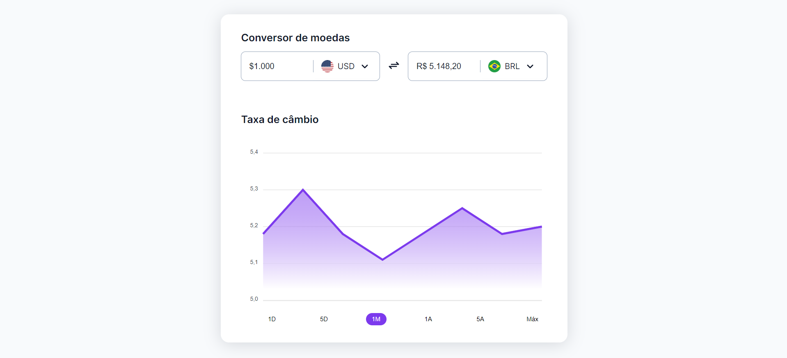
        </a>
      </td>
    </tr>
    <tr>
      <td align="center">
        10
      </td>
      <td align="center">
        <a href="10-pagina-clima">Página de clima</a>
      </td>
      <td align="center">
        <a href="10-pagina-clima">
          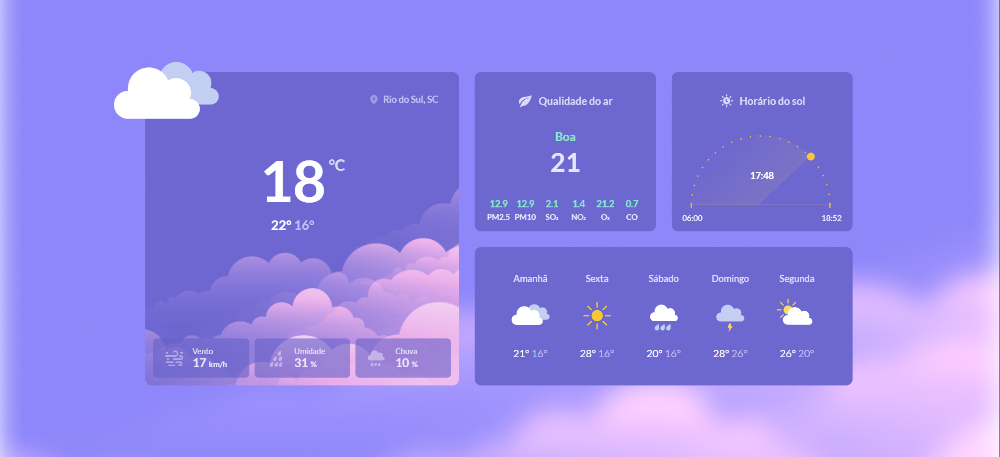
        </a>
      </td>
    </tr>
    <tr>
      <td align="center">
        11
      </td>
      <td align="center">
        <a href="11-tela-login">Tela de login</a>
      </td>
      <td align="center">
        
      </td>
    </tr>
    <tr>
      <td align="center">
        12
      </td>
      <td align="center">
        <a href="12-kanban">Kanban</a>
      </td>
      <td align="center">
        <a href="12-kanban">
          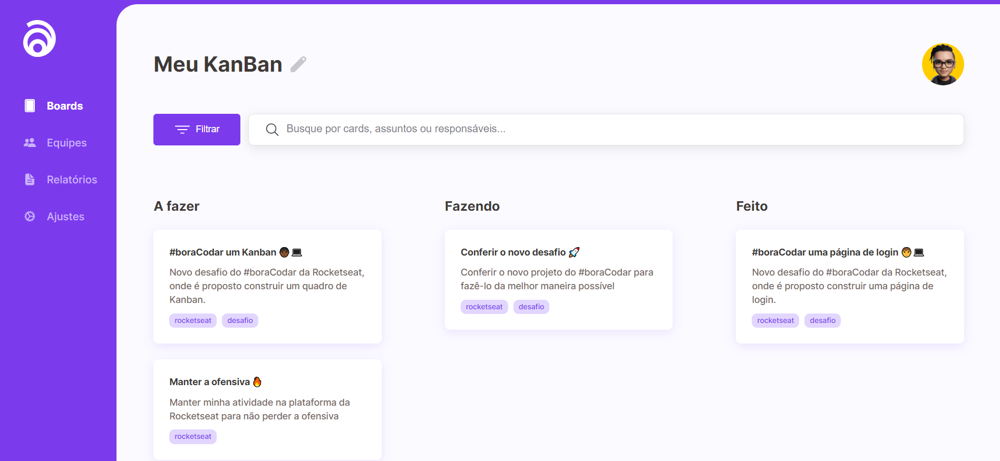
        </a>
      </td>
    </tr>
    <tr>
      <td align="center">
        13
      </td>
      <td align="center">
        <a href="13-form-cartao-credito">Formulário de cartão de crédito</a>
      </td>
      <td align="center">
        <a href="13-form-cartao-credito">
          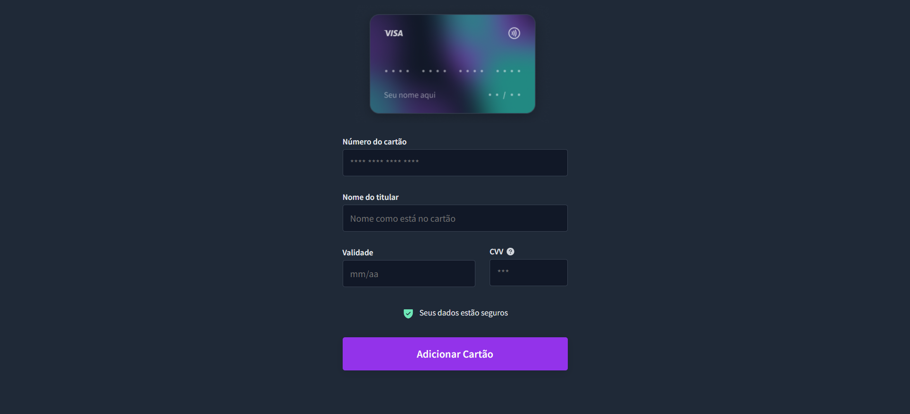
        </a>
      </td>
    </tr>
    <tr>
      <td align="center">
        14
      </td>
      <td align="center">
        <a href="14-componente-upload">Componente de upload</a>
      </td>
      <td align="center">
        <a href="14-componente-upload">
          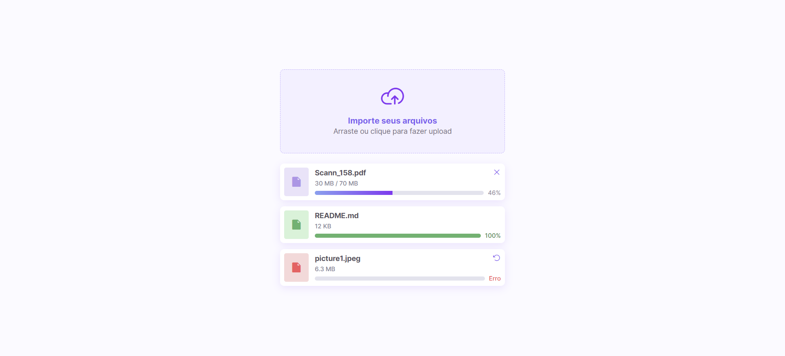
        </a>
      </td>
    </tr>
    <tr>
      <td align="center">
        15
      </td>
      <td align="center">
        <a href="15-pricing-table">Pricing Table</a>
      </td>
      <td align="center">
        <a href="15-pricing-table">
          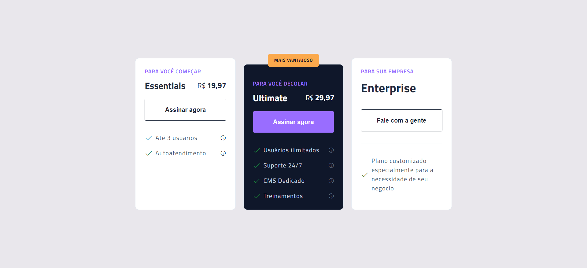
        </a>
      </td>
    </tr>
    <tr>
      <td align="center">
        16
      </td>
      <td align="center">
        <a href="16-pagina-contatos">Página de Contatos</a>
      </td>
      <td align="center">
        <a href="16-pagina-contatos">
          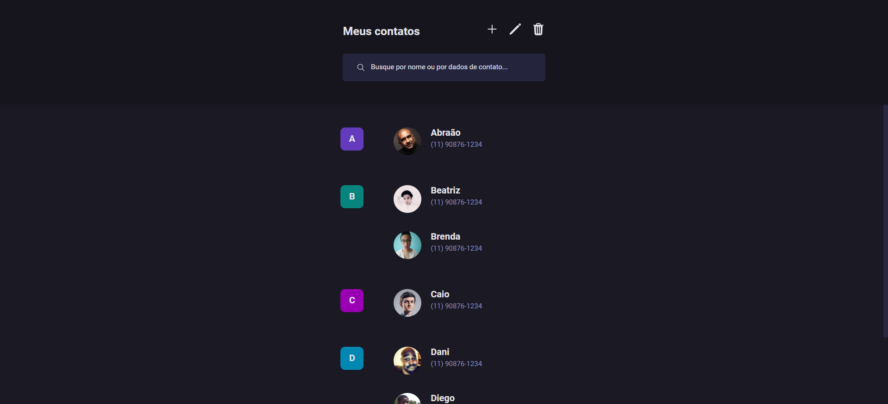
        </a>
      </td>
    </tr>
    <tr>
      <td align="center">
        17
      </td>
      <td align="center">
        <a href="17-date-picker">Date Picker</a>
      </td>
      <td align="center">
        <a href="17-date-picker">
          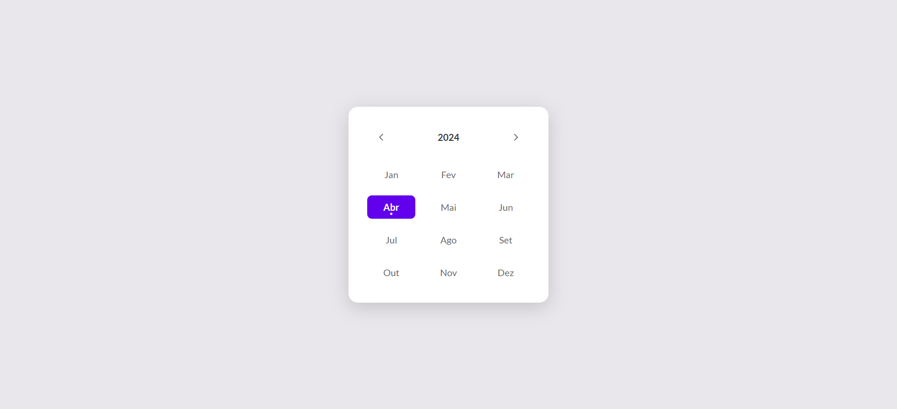
        </a>
      </td>
    </tr>
    <tr>
      <td align="center">
        18
      </td>
      <td align="center">
        <a href="18-card-personagem">Card de Personagem</a>
      </td>
      <td align="center">
        <a href="18-card-personagem">
          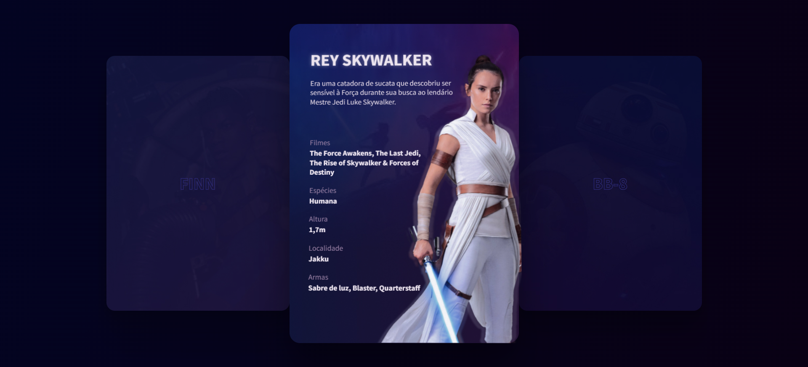
        </a>
      </td>
    </tr>
    <tr>
      <td align="center">
        19
      </td>
      <td align="center">
        <a href="19-widget-transporte">Widget de Transporte</a>
      </td>
      <td align="center">
        
      </td>
    </tr>
    <tr>
      <td align="center">
        20
      </td>
      <td align="center">
        <a href="20-galeria-hover">Galeria com Hover</a>
      </td>
      <td align="center">
        <a href="20-galeria-hover">
          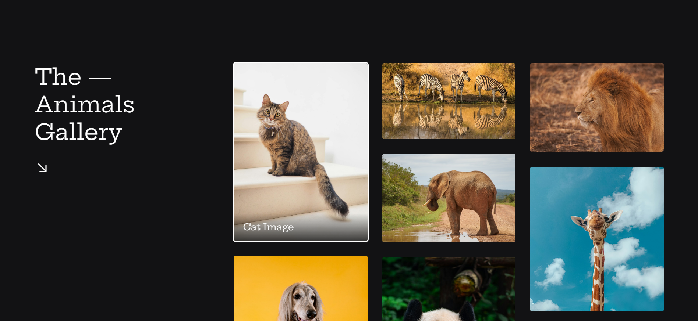
        </a>
      </td>
    </tr>
    <tr>
      <td align="center">
        21
      </td>
      <td align="center">
        <a href="21-carrinho-compras">Carinho de Compras</a>
      </td>
      <td align="center">
        <a href="21-carrinho-compras">
          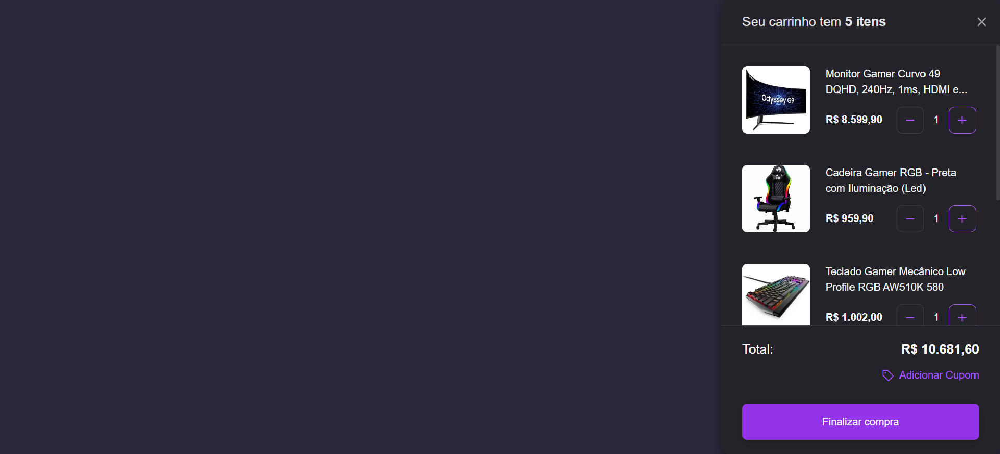
        </a>
      </td>
    </tr>
    <tr>
      <td align="center">
        22
      </td>
      <td align="center">
        <a href="22-profile-settings">Profile Settings</a>
      </td>
      <td align="center">
        <a href="22-profile-settings">
          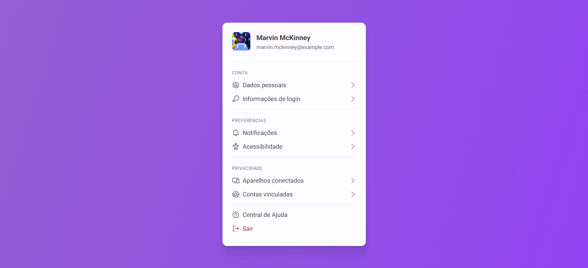
        </a>
      </td>
    </tr>
    <tr>
      <td align="center">
        23
      </td>
      <td align="center">
        <a href="23-form-multi-step">Formulário Multi Step</a>
      </td>
      <td align="center">
        <a href="23-form-multi-step">
          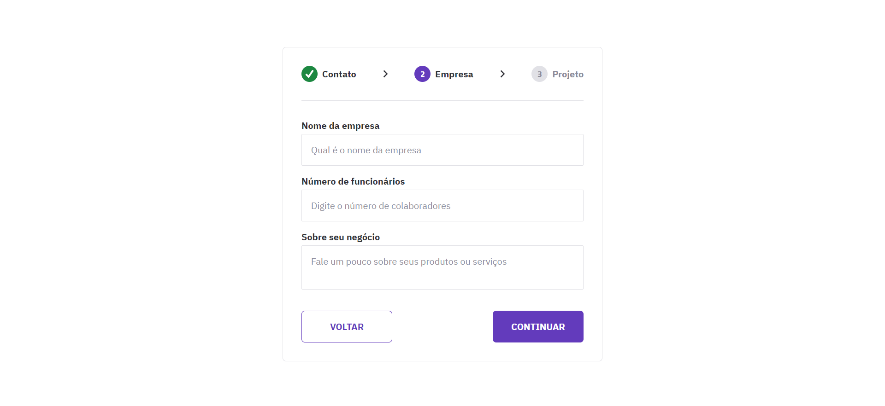
        </a>
      </td>
    </tr>
    <tr>
      <td align="center">
        24
      </td>
      <td align="center">
        <a href="24-ajustes-iluminacao">Ajustes de Iluminação</a>
      </td>
      <td align="center">
        <a href="24-ajustes-iluminacao">
          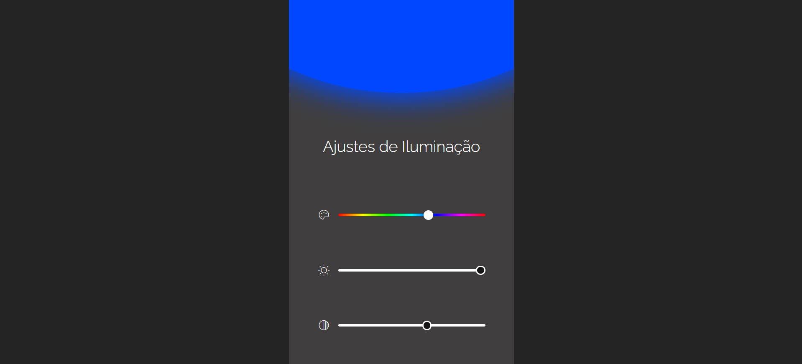
        </a>
      </td>
    </tr>
    <tr>
      <td align="center">
        25
      </td>
      <td align="center">
        <a href="25-player-vr">Player de VR</a>
      </td>
      <td align="center">
        <a href="25-player-vr">
          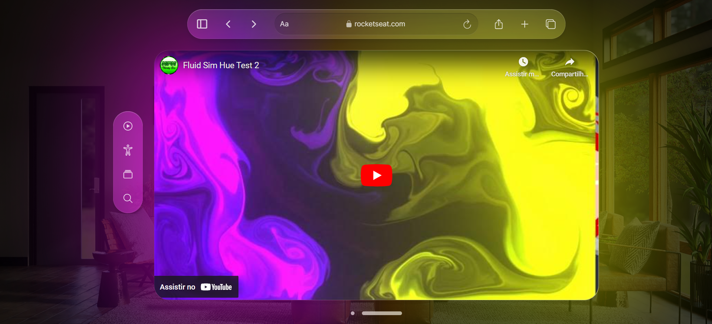
        </a>
      </td>
    </tr>
    <tr>
      <td align="center">
        26
      </td>
      <td align="center">
        <a href="26-receita-junina">Receita Junina</a>
      </td>
      <td align="center">
        <a href="26-receita-junina">
          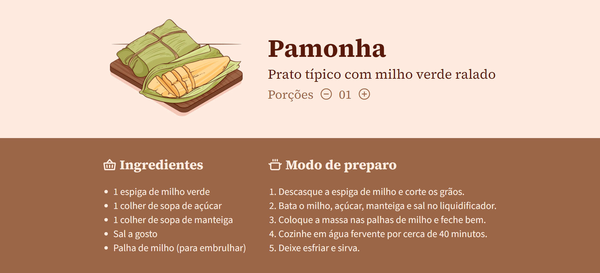
        </a>
      </td>
    </tr>
    <tr>
      <td align="center">
        27
      </td>
      <td align="center">
        <a href="27-pagina-404">Página 404</a>
      </td>
      <td align="center">
        <a href="27-pagina-404">
          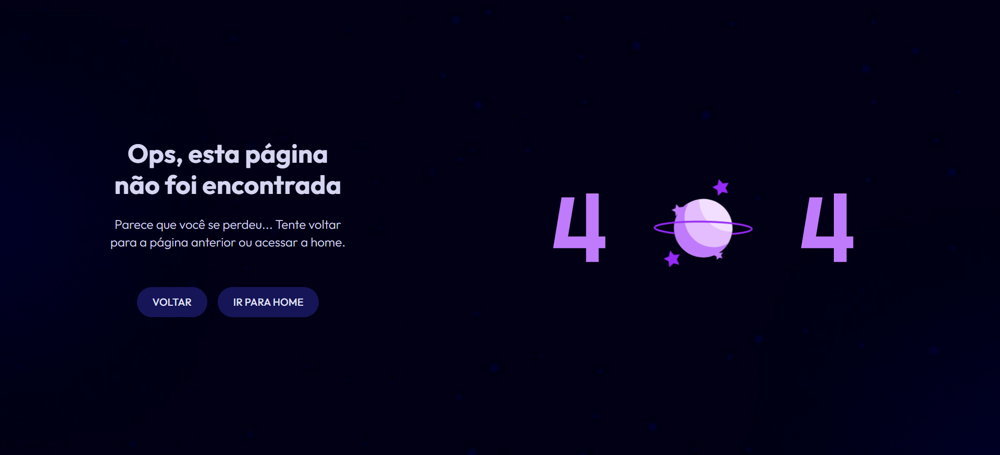
        </a>
      </td>
    </tr>
    <tr>
      <td align="center">
        28
      </td>
      <td align="center">
        <a href="28-plataforma-ia">Plataforma de IA</a>
      </td>
      <td align="center">
        <a href="28-plataforma-ia">
          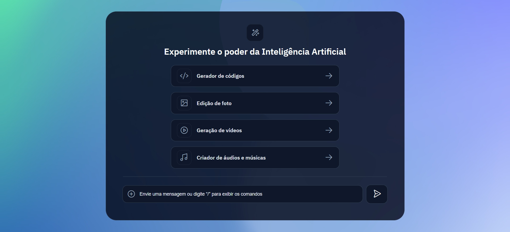
        </a>
      </td>
    </tr>
    <tr>
      <td align="center">
        29
      </td>
      <td align="center">
        <a href="29-antes-depois-ia">Antes e Depois com IA</a>
      </td>
      <td align="center">
        
      </td>
    </tr>
    <tr>
      <td align="center">
        30
      </td>
      <td align="center">
        <a href="30-recomendacao-filme-ia">Recomendação de Filme com IA</a>
      </td>
      <td align="center">
        
      </td>
    </tr>
    <tr>
      <td align="center">
        31
      </td>
      <td align="center">
        <a href="31-transcricao-video-ia">Transcrição de Vídeo com IA</a>
      </td>
      <td align="center">
        <a href="31-transcricao-video-ia">
          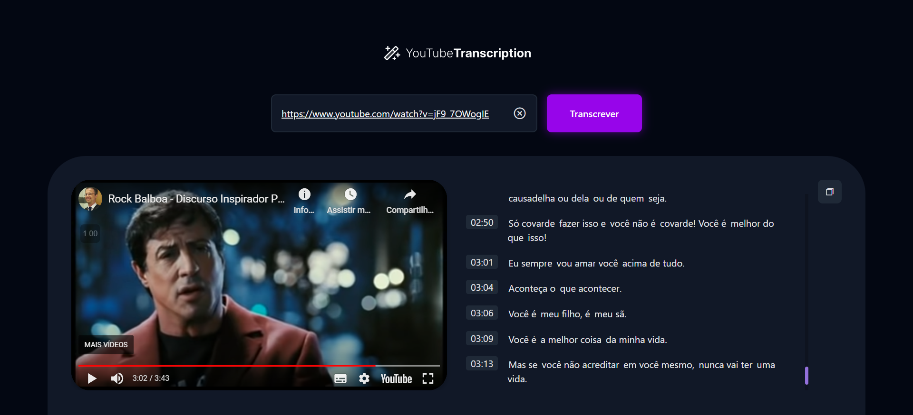
        </a>
      </td>
    </tr>
    <tr>
      <td align="center">
        32
      </td>
      <td align="center">
        <a href="32-traducao-sql-ia">App de tradução de SQL com IA</a>
      </td>
      <td align="center">
        <a href="32-traducao-sql-ia">
          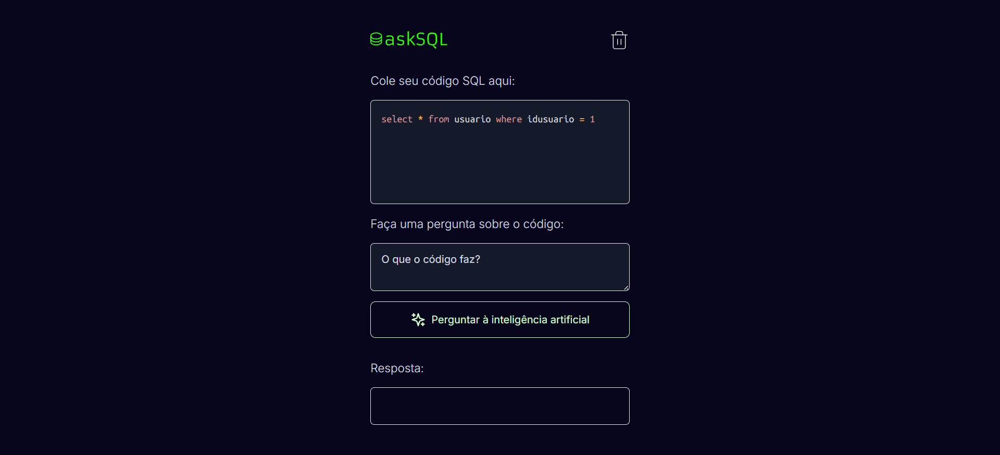
        </a>
      </td>
    </tr>
    <tr>
      <td align="center">
        33
      </td>
      <td align="center">
        <a href="33-gerador-ticket">Gerador de Ticket</a>
      </td>
      <td align="center">
        
      </td>
    </tr>
    <tr>
      <td align="center">
        34
      </td>
      <td align="center">
        <a href="34-lista-compras">Lista de Compras</a>
      </td>
      <td align="center">
        <a href="34-lista-compras">
          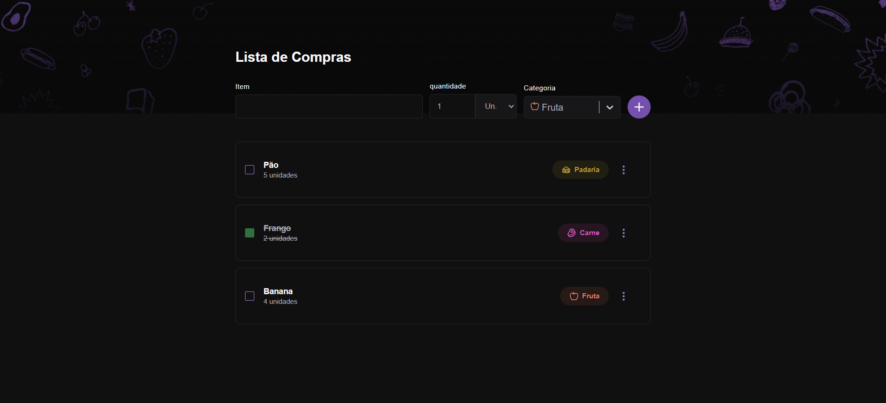
        </a>
      </td>
    </tr>
    <tr>
      <td align="center">
        35
      </td>
      <td align="center">
        <a href="35-reminder-beber-agua">Reminder Beber Água</a>
      </td>
      <td align="center">
        <a href="35-reminder-beber-agua">
          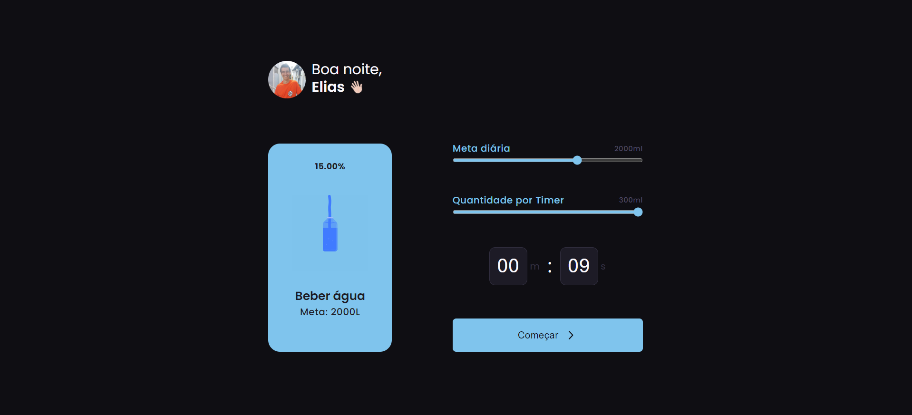
        </a>
      </td>
    </tr>
    <tr>
      <td align="center">
        36
      </td>
      <td align="center">
        <a href="36-tabela-nutricional">Tabela Nutricional</a>
      </td>
      <td align="center">
        <a href="36-tabela-nutricional">
          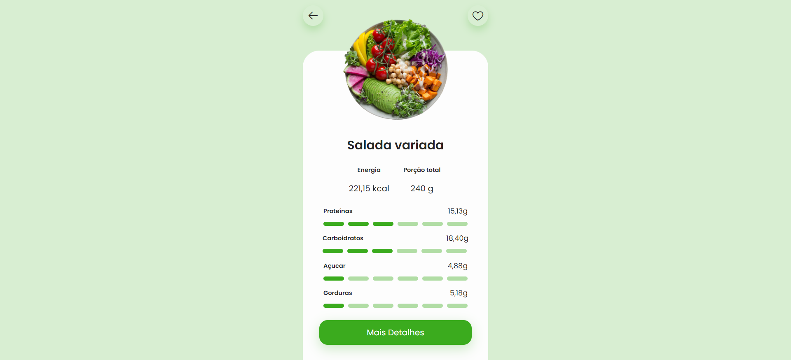
        </a>
      </td>
    </tr>
    <tr>
      <td align="center">
        37
      </td>
      <td align="center">
        <a href="37-app-sono-smartwatch">App de Sono para Smartwatch</a>
      </td>
      <td align="center">
        
      </td>
    </tr>
    <tr>
      <td align="center">
        38
      </td>
      <td align="center">
        <a href="38-quiz-card-imagem">Quiz de Card com Imagem</a>
      </td>
      <td align="center">
        <a href="38-quiz-card-imagem">
          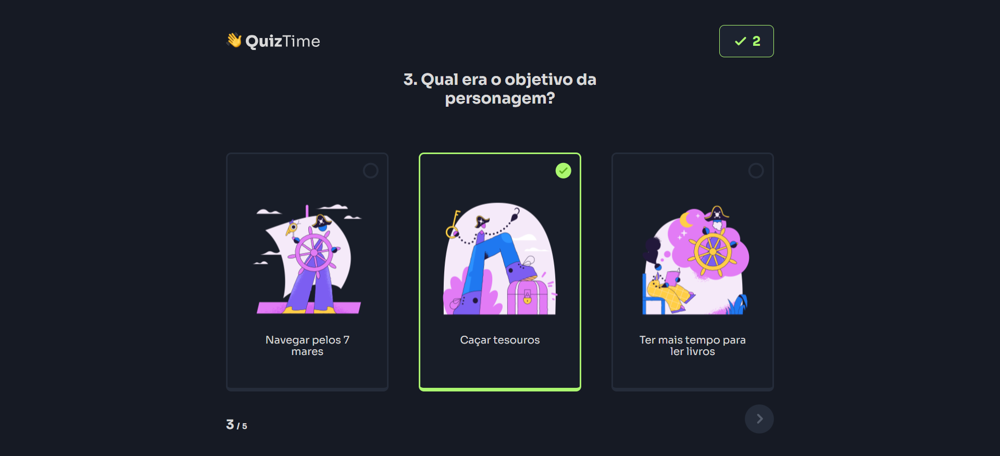
        </a>
      </td>
    </tr>
    <tr>
      <td align="center">
        39
      </td>
      <td align="center">
        <a href="39-avaliacao-produto">Avaliação de Produto</a>
      </td>
      <td align="center">
        
      </td>
    </tr>
    <tr>
      <td align="center">
        40
      </td>
      <td align="center">
        <a href="40-newsletter">Newsletter</a>
      </td>
      <td align="center">
        <a href="40-newsletter">
          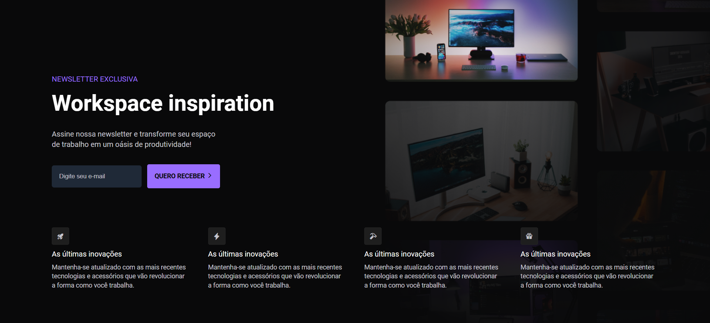
        </a>
      </td>
    </tr>
  </tbody>
</table>
